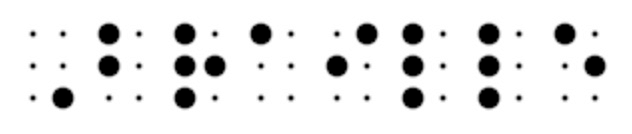
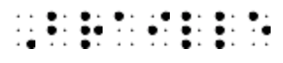
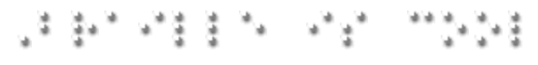

# Braille-Tools

CSS and Javascript to display Braille (grade 1) in web pages (for sighted people).

Check out the [live demo](https://evoluteur.github.io/braille-tools/index.html).

It comes in 3 different styles:

### See your name in Braille

### Braille Alphabet

For displaying the character on hover (with animation), use my other script [Braille-Text](https://github.com/evoluteur/braille-text).

### License

Braille-Tools is released under the [MIT license](http://github.com/evoluteur/braille/blob/master/LICENSE.md).

Encourage this project by [becoming a sponsor](https://github.com/sponsors/evoluteur).

(c) 2016-2025 [Olivier Giulieri](https://evoluteur.github.io/)
